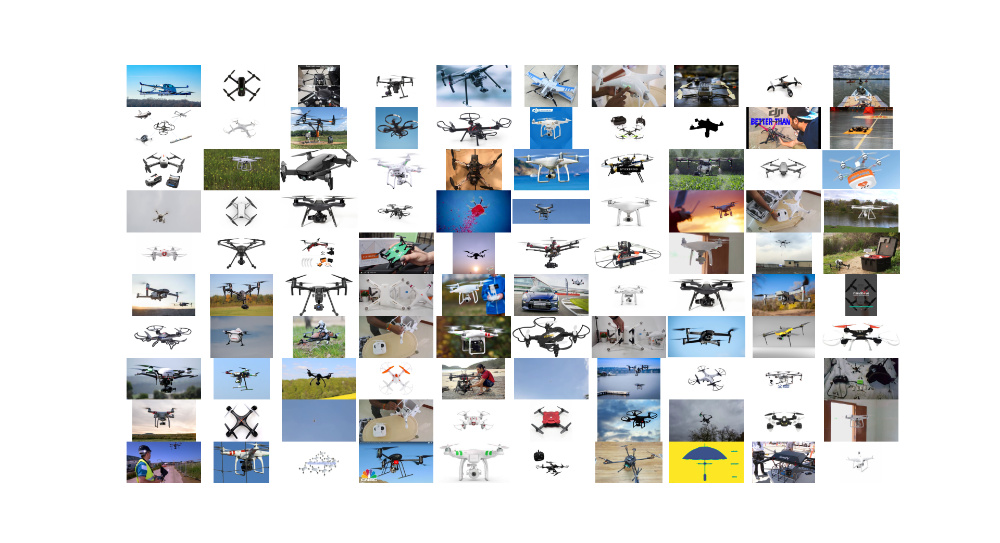

# Drone Detection Dataset

Welcome to the Drone Detection Dataset repository! This collection has been meticulously curated to provide a comprehensive dataset for drone detection tasks. Here you will find approximately 4,230 labeled images of drones sourced from two major datasets:

1. **Kaggle - Drone Dataset**: This set includes a diverse range of drone images that have been gathered and labeled for object detection. For more information and to download the data, visit [Kaggle Drone Dataset by Mehdi …zel](https://www.kaggle.com/datasets/dasmehdixtr/drone-dataset-uav).

2. **Mendeley - Drone Dataset**: A rich dataset from Mendeley that features labeled drone images suitable for various detection algorithms. For additional details and to access this dataset, go to [Mendeley Drone Dataset](https://data.mendeley.com/datasets/zcsj2g2m4c/4).

The datasets have been organized into two separate folders within this repository for your convenience:

- `Kaggle - Drone Dataset`
- `Mendeley - Drone Dataset`

## Visual Overview



Above is a 10x10 grid visual representation featuring a selection of 100 images randomly chosen from the combined dataset to give you a glimpse into the variety and complexity of the drone images included.

## Dataset Structure

The repository is structured as follows:

```
/drone-detection-dataset
    /Kaggle - Drone Dataset
    /Mendeley - Drone Dataset
```

## Usage

This dataset is intended for use in machine learning models and algorithms focused on drone detection. Whether you are developing real-time detection systems or conducting research in the field of aerial surveillance, this dataset is equipped to provide a significant variety and volume of drone images to test and train your models.

## Contribution

Contributions to this dataset are welcome. If you have a collection of labeled drone images that you would like to share, please open a pull request with your proposed additions.


Thank you for visiting this repository, and we hope it serves as a valuable resource for your drone detection endeavors!
